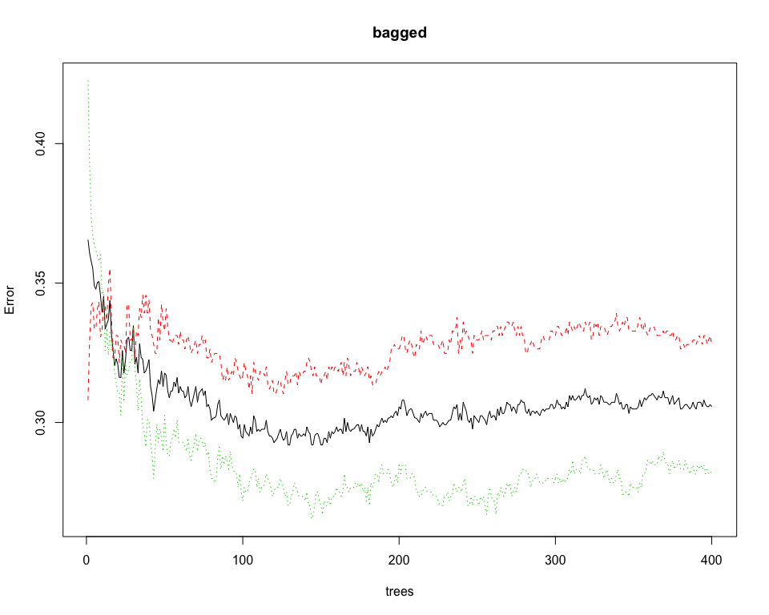

Medical ML
================
Natalie Rozak
12/21/2019

``` r
# global imports
# data preprocessing
library(plyr)
library(tidyverse)
library(caret)
library(fastDummies)
# data visualization
library(ggplot2)
library(car)
library(ROCR)
# machine learning
library(glmnet)
library(class)
library(reshape2)
library(tree)
library(maptree)
library(randomForest)
library(gbm)
library(e1071)

# supress scientific notation
options(scipen=999)
```

# Data Preprocessing

## Raw Data

``` r
# import data
raw_data <- read.csv('~/Documents/GitHub/DSC_Medical_ML/stroke.csv')
# output structure of the data
str(raw_data)
```

    ## 'data.frame':    43400 obs. of  12 variables:
    ##  $ id               : int  30669 30468 16523 56543 46136 32257 52800 41413 15266 28674 ...
    ##  $ gender           : Factor w/ 3 levels "Female","Male",..: 2 2 1 1 2 1 1 1 1 1 ...
    ##  $ age              : num  3 58 8 70 14 47 52 75 32 74 ...
    ##  $ hypertension     : int  0 1 0 0 0 0 0 0 0 1 ...
    ##  $ heart_disease    : int  0 0 0 0 0 0 0 1 0 0 ...
    ##  $ ever_married     : Factor w/ 2 levels "No","Yes": 1 2 1 2 1 2 2 2 2 2 ...
    ##  $ work_type        : Factor w/ 5 levels "children","Govt_job",..: 1 4 4 4 3 4 4 5 4 5 ...
    ##  $ Residence_type   : Factor w/ 2 levels "Rural","Urban": 1 2 2 1 1 2 2 1 1 2 ...
    ##  $ avg_glucose_level: num  95.1 88 110.9 69 161.3 ...
    ##  $ bmi              : num  18 39.2 17.6 35.9 19.1 50.1 17.7 27 32.3 54.6 ...
    ##  $ smoking_status   : Factor w/ 4 levels "","formerly smoked",..: 1 3 1 2 1 1 2 3 4 3 ...
    ##  $ stroke           : int  0 0 0 0 0 0 0 0 0 0 ...

``` r
# output summary of each variable
summary(raw_data)
```

    ##        id           gender           age         hypertension    
    ##  Min.   :    1   Female:25665   Min.   : 0.08   Min.   :0.00000  
    ##  1st Qu.:18038   Male  :17724   1st Qu.:24.00   1st Qu.:0.00000  
    ##  Median :36352   Other :   11   Median :44.00   Median :0.00000  
    ##  Mean   :36326                  Mean   :42.22   Mean   :0.09357  
    ##  3rd Qu.:54514                  3rd Qu.:60.00   3rd Qu.:0.00000  
    ##  Max.   :72943                  Max.   :82.00   Max.   :1.00000  
    ##                                                                  
    ##  heart_disease     ever_married         work_type     Residence_type
    ##  Min.   :0.00000   No :15462    children     : 6156   Rural:21644   
    ##  1st Qu.:0.00000   Yes:27938    Govt_job     : 5440   Urban:21756   
    ##  Median :0.00000                Never_worked :  177                 
    ##  Mean   :0.04751                Private      :24834                 
    ##  3rd Qu.:0.00000                Self-employed: 6793                 
    ##  Max.   :1.00000                                                    
    ##                                                                     
    ##  avg_glucose_level      bmi                smoking_status      stroke       
    ##  Min.   : 55.00    Min.   :10.10                  :13292   Min.   :0.00000  
    ##  1st Qu.: 77.54    1st Qu.:23.20   formerly smoked: 7493   1st Qu.:0.00000  
    ##  Median : 91.58    Median :27.70   never smoked   :16053   Median :0.00000  
    ##  Mean   :104.48    Mean   :28.61   smokes         : 6562   Mean   :0.01804  
    ##  3rd Qu.:112.07    3rd Qu.:32.90                           3rd Qu.:0.00000  
    ##  Max.   :291.05    Max.   :97.60                           Max.   :1.00000  
    ##                    NA's   :1462

``` r
# output number of missing values in each variable
sapply(raw_data, function(x) sum(is.na(x)))
```

    ##                id            gender               age      hypertension 
    ##                 0                 0                 0                 0 
    ##     heart_disease      ever_married         work_type    Residence_type 
    ##                 0                 0                 0                 0 
    ## avg_glucose_level               bmi    smoking_status            stroke 
    ##                 0              1462                 0                 0

## Clean Data

Steps to clean the data:

1.  Remove id column

<!-- end list -->

  - id is a unique identifier that does not provide helpful predictive
    information

<!-- end list -->

2.  Remove rows where gender=‘Other’

<!-- end list -->

  - There are only 11 observations where gender=‘Other’
  - Having a category with very few observations will be challenging for
    the models to learn

<!-- end list -->

3.  Convert gender to a factor
4.  Set empty levels of smoking\_status to ‘unknown’
5.  Set missing values in bmi to the median of bmi

<!-- end list -->

  - The distribution of bmi is bell-shaped with large outliers
  - The median is a more robust metric than the mean

<!-- end list -->

6.  Filter data where age \>= 34.82

<!-- end list -->

  - age=34.82 is the first percentile of age where an observation had a
    stroke
  - Since most people don’t get strokes until later in life, I will
    limit my model to only consider older people

<!-- end list -->

7.  Remove observations where work\_type = ‘Never\_worked’

<!-- end list -->

  - After cleaning the data, there are only 3 observations in this
    category

<!-- end list -->

8.  Convert work\_type to a factor

<!-- end list -->

  - This removes empty levels

<!-- end list -->

``` r
# create data frame
clean_data <- raw_data
# remove id column
clean_data <- clean_data %>% select(-c(id))
# remove observations where gender = 'Other'
clean_data <- clean_data %>% subset(clean_data$gender != 'Other')
# convert gender to a factor
clean_data$gender <- factor(clean_data$gender)
# change empty levelvs in smoking_status to 'unknown'
levels(clean_data$smoking_status)[1] <- "unknown"
# summary of the data
summary(clean_data)
```

    ##     gender           age         hypertension    heart_disease     ever_married
    ##  Female:25665   Min.   : 0.08   Min.   :0.0000   Min.   :0.00000   No :15456   
    ##  Male  :17724   1st Qu.:24.00   1st Qu.:0.0000   1st Qu.:0.00000   Yes:27933   
    ##                 Median :44.00   Median :0.0000   Median :0.00000               
    ##                 Mean   :42.22   Mean   :0.0936   Mean   :0.04752               
    ##                 3rd Qu.:60.00   3rd Qu.:0.0000   3rd Qu.:0.00000               
    ##                 Max.   :82.00   Max.   :1.0000   Max.   :1.00000               
    ##                                                                                
    ##          work_type     Residence_type avg_glucose_level      bmi       
    ##  children     : 6154   Rural:21638    Min.   : 55.00    Min.   :10.10  
    ##  Govt_job     : 5438   Urban:21751    1st Qu.: 77.54    1st Qu.:23.20  
    ##  Never_worked :  177                  Median : 91.58    Median :27.70  
    ##  Private      :24827                  Mean   :104.49    Mean   :28.61  
    ##  Self-employed: 6793                  3rd Qu.:112.07    3rd Qu.:32.90  
    ##                                       Max.   :291.05    Max.   :97.60  
    ##                                                         NA's   :1458   
    ##          smoking_status      stroke       
    ##  unknown        :13290   Min.   :0.00000  
    ##  formerly smoked: 7487   1st Qu.:0.00000  
    ##  never smoked   :16051   Median :0.00000  
    ##  smokes         : 6561   Mean   :0.01805  
    ##                          3rd Qu.:0.00000  
    ##                          Max.   :1.00000  
    ## 

``` r
# histogram of bmi
ggplot(data=subset(clean_data, !is.na(bmi)), aes(x=bmi)) +
  geom_histogram(binwidth=3) + 
  ggtitle('BMI Score Histogram')
```


From the histogram, we see the BMI scores are bell-shaped, but skewed to
the right. Because of this, I will replace missing values with the
median. The median is a robust measure of central tendency, so it
shouldn’t be negatively affected by the outliers.

``` r
# convert bmi missing values to the median
clean_data <- clean_data %>% mutate(bmi=ifelse(is.na(bmi), 
                                               median(bmi, na.rm=TRUE), bmi))
# confirm missing values were removed
summary(clean_data$bmi)
```

    ##    Min. 1st Qu.  Median    Mean 3rd Qu.    Max. 
    ##   10.10   23.40   27.70   28.57   32.60   97.60

``` r
# plot density distribution for age and stroke
p <- ggplot(clean_data, mapping=aes(x=age, fill=as.factor(stroke),
                               color=as.factor(stroke)))
p + geom_density(alpha=0.3) + ggtitle('Density Plot for Age Colored by Stroke')
```


The density plot shows most people don’t get strokes until later in
life.

``` r
# obtain quantiles of ages that people have strokes
stroke_ages <- clean_data$age[clean_data$stroke==1]
summary(stroke_ages)
```

    ##    Min. 1st Qu.  Median    Mean 3rd Qu.    Max. 
    ##    1.32   60.00   71.00   68.14   79.00   82.00

When examining the ages of people who have strokes, I see most people
have strokes later in life.

``` r
# output the first percentile of stroke age
stroke_ages %>% quantile(c(0.01))
```

    ##    1% 
    ## 34.82

The first percentile of people who have had strokes is 34.82 years old.

``` r
# remove observations with age<34.82
clean_data <- clean_data %>% subset(clean_data$age >= 34.82)
# summary of the data
summary(clean_data)
```

    ##     gender           age         hypertension    heart_disease     ever_married
    ##  Female:16108   Min.   :35.00   Min.   :0.0000   Min.   :0.00000   No : 2536   
    ##  Male  :10881   1st Qu.:46.00   1st Qu.:0.0000   1st Qu.:0.00000   Yes:24453   
    ##                 Median :56.00   Median :0.0000   Median :0.00000               
    ##                 Mean   :56.95   Mean   :0.1447   Mean   :0.07581               
    ##                 3rd Qu.:67.00   3rd Qu.:0.0000   3rd Qu.:0.00000               
    ##                 Max.   :82.00   Max.   :1.0000   Max.   :1.00000               
    ##          work_type     Residence_type avg_glucose_level      bmi       
    ##  children     :    0   Rural:13427    Min.   : 55.01    Min.   :10.10  
    ##  Govt_job     : 4407   Urban:13562    1st Qu.: 78.65    1st Qu.:26.10  
    ##  Never_worked :    3                  Median : 93.74    Median :29.40  
    ##  Private      :16442                  Mean   :111.01    Mean   :30.63  
    ##  Self-employed: 6137                  3rd Qu.:120.11    3rd Qu.:34.10  
    ##                                       Max.   :291.05    Max.   :92.00  
    ##          smoking_status      stroke       
    ##  unknown        : 5213   Min.   :0.00000  
    ##  formerly smoked: 6200   1st Qu.:0.00000  
    ##  never smoked   :10853   Median :0.00000  
    ##  smokes         : 4723   Mean   :0.02872  
    ##                          3rd Qu.:0.00000  
    ##                          Max.   :1.00000

I chose to remove observations where age\<34.82. Most people don’t have
strokes until later in life, as shown both by the data and proven from
my prior knowledge about strokes. Therefore, it seems reasonable to
limit my models to only consider older people. Including younger ages in
the data will teach the model to classify solely based on age, and the
model will be very imprecise for older ages.

``` r
# remove observations were work_type='Never_worked'
clean_data <- clean_data %>% subset(clean_data$work_type != 'Never_worked')
# make work_type a factor
clean_data$work_type <- factor(clean_data$work_type)
```

``` r
# create model_data out of clean_data
model_data <- clean_data
# structure of model data
str(model_data)
```

    ## 'data.frame':    26986 obs. of  11 variables:
    ##  $ gender           : Factor w/ 2 levels "Female","Male": 2 1 1 1 1 1 1 2 1 1 ...
    ##  $ age              : num  58 70 47 52 75 74 79 79 37 37 ...
    ##  $ hypertension     : int  1 0 0 0 0 1 0 0 0 0 ...
    ##  $ heart_disease    : int  0 0 0 0 1 0 0 1 0 0 ...
    ##  $ ever_married     : Factor w/ 2 levels "No","Yes": 2 2 2 2 2 2 2 2 2 2 ...
    ##  $ work_type        : Factor w/ 3 levels "Govt_job","Private",..: 2 2 2 2 3 3 1 2 2 2 ...
    ##  $ Residence_type   : Factor w/ 2 levels "Rural","Urban": 2 1 2 2 1 2 2 2 1 1 ...
    ##  $ avg_glucose_level: num  88 69 210.9 77.6 243.5 ...
    ##  $ bmi              : num  39.2 35.9 50.1 17.7 27 54.6 35 22 39.4 26.1 ...
    ##  $ smoking_status   : Factor w/ 4 levels "unknown","formerly smoked",..: 3 2 1 2 3 3 1 2 3 2 ...
    ##  $ stroke           : int  0 0 0 0 0 0 0 0 0 0 ...

``` r
# summary of model data variables
summary(model_data)
```

    ##     gender           age         hypertension    heart_disease     ever_married
    ##  Female:16107   Min.   :35.00   Min.   :0.0000   Min.   :0.00000   No : 2536   
    ##  Male  :10879   1st Qu.:46.00   1st Qu.:0.0000   1st Qu.:0.00000   Yes:24450   
    ##                 Median :56.00   Median :0.0000   Median :0.00000               
    ##                 Mean   :56.95   Mean   :0.1447   Mean   :0.07582               
    ##                 3rd Qu.:67.00   3rd Qu.:0.0000   3rd Qu.:0.00000               
    ##                 Max.   :82.00   Max.   :1.0000   Max.   :1.00000               
    ##          work_type     Residence_type avg_glucose_level      bmi       
    ##  Govt_job     : 4407   Rural:13427    Min.   : 55.01    Min.   :10.10  
    ##  Private      :16442   Urban:13559    1st Qu.: 78.64    1st Qu.:26.10  
    ##  Self-employed: 6137                  Median : 93.73    Median :29.40  
    ##                                       Mean   :111.00    Mean   :30.63  
    ##                                       3rd Qu.:120.10    3rd Qu.:34.10  
    ##                                       Max.   :291.05    Max.   :92.00  
    ##          smoking_status      stroke       
    ##  unknown        : 5213   Min.   :0.00000  
    ##  formerly smoked: 6197   1st Qu.:0.00000  
    ##  never smoked   :10853   Median :0.00000  
    ##  smokes         : 4723   Mean   :0.02872  
    ##                          3rd Qu.:0.00000  
    ##                          Max.   :1.00000

## Prepare Data for Machine Learning

Steps to Prepare Data for Machine Learning

1.  Downsample the data
2.  Split the data into train and test
3.  Convert the data into various formats so it is usable for each model

<!-- end list -->

  - Indicator variables for categorical data
  - Scaled predictors for distance models
  - Matrix format

<!-- end list -->

``` r
# number of observations that have not had a stroke
length(model_data$stroke[model_data$stroke==0])
```

    ## [1] 26211

``` r
# number of observations that 
length(model_data$stroke[model_data$stroke==1])
```

    ## [1] 775

Most observations have not had a stroke, meaning our data is imbalanced.
If I keep my data as is, my models will have very high accuracy rates,
but they won’t generate good insights about patients who have strokes.I
can expect the models to properly classify the patients that don’t have
strokes, and for there to be large misclassifications for patients with
strokes. This is problematic since I want to predict whether a person
has had a stroke.

``` r
set.seed(3)
# downsample data
data_down <- downSample(x=select(model_data, -c(stroke)), 
                        y=as.factor(model_data$stroke))
# structure of downsampled data
str(data_down)
```

    ## 'data.frame':    1550 obs. of  11 variables:
    ##  $ gender           : Factor w/ 2 levels "Female","Male": 2 1 1 1 1 2 1 1 1 1 ...
    ##  $ age              : num  37 49 38 59 54 80 47 36 78 51 ...
    ##  $ hypertension     : int  0 0 0 0 0 0 0 0 0 0 ...
    ##  $ heart_disease    : int  0 0 0 0 0 0 0 0 0 0 ...
    ##  $ ever_married     : Factor w/ 2 levels "No","Yes": 2 2 2 2 2 2 2 2 1 2 ...
    ##  $ work_type        : Factor w/ 3 levels "Govt_job","Private",..: 2 2 2 2 1 3 2 2 2 2 ...
    ##  $ Residence_type   : Factor w/ 2 levels "Rural","Urban": 2 2 1 2 1 2 2 2 2 2 ...
    ##  $ avg_glucose_level: num  112.6 70.3 112 105.1 88.9 ...
    ##  $ bmi              : num  30.3 27.1 33.2 22.9 21.7 30.7 23.3 28.9 26.8 33.4 ...
    ##  $ smoking_status   : Factor w/ 4 levels "unknown","formerly smoked",..: 4 2 4 1 1 2 3 3 2 2 ...
    ##  $ Class            : Factor w/ 2 levels "0","1": 1 1 1 1 1 1 1 1 1 1 ...

``` r
# summary of downsampled data
summary(data_down)
```

    ##     gender         age         hypertension    heart_disease    ever_married
    ##  Female:898   Min.   :35.00   Min.   :0.0000   Min.   :0.0000   No : 151    
    ##  Male  :652   1st Qu.:51.00   1st Qu.:0.0000   1st Qu.:0.0000   Yes:1399    
    ##               Median :63.00   Median :0.0000   Median :0.0000               
    ##               Mean   :62.29   Mean   :0.1987   Mean   :0.1516               
    ##               3rd Qu.:76.00   3rd Qu.:0.0000   3rd Qu.:0.0000               
    ##               Max.   :82.00   Max.   :1.0000   Max.   :1.0000               
    ##          work_type   Residence_type avg_glucose_level      bmi       
    ##  Govt_job     :204   Rural:772      Min.   : 55.01    Min.   :14.30  
    ##  Private      :923   Urban:778      1st Qu.: 79.81    1st Qu.:26.00  
    ##  Self-employed:423                  Median : 97.47    Median :28.40  
    ##                                     Mean   :119.72    Mean   :29.85  
    ##                                     3rd Qu.:152.02    3rd Qu.:32.80  
    ##                                     Max.   :281.18    Max.   :64.20  
    ##          smoking_status Class  
    ##  unknown        :281    0:775  
    ##  formerly smoked:389    1:775  
    ##  never smoked   :599           
    ##  smokes         :281           
    ##                                
    ## 

I chose to downsample my data. Unfortunately, this means a lot of my
information about patients who have not had a stroke has been lost.
However, if I upsampled my data, there would have been many repeats of
observations and the models would be prone to overfitting or incorrectly
reporting high accuracy rates by training and testing the models on the
same data.

``` r
# arguments for splitting data
n <- nrow(data_down)
set.seed(6)
ind_train <- sample.int(n, 0.8*n) 
# train data set
train_full <- data_down[ind_train,]
# test data set
test_full <- data_down[-ind_train,]
# summary of train data set
summary(train_full)
```

    ##     gender         age         hypertension    heart_disease    ever_married
    ##  Female:714   Min.   :35.00   Min.   :0.0000   Min.   :0.0000   No : 118    
    ##  Male  :526   1st Qu.:51.00   1st Qu.:0.0000   1st Qu.:0.0000   Yes:1122    
    ##               Median :63.00   Median :0.0000   Median :0.0000               
    ##               Mean   :62.42   Mean   :0.1984   Mean   :0.1589               
    ##               3rd Qu.:76.00   3rd Qu.:0.0000   3rd Qu.:0.0000               
    ##               Max.   :82.00   Max.   :1.0000   Max.   :1.0000               
    ##          work_type   Residence_type avg_glucose_level      bmi       
    ##  Govt_job     :158   Rural:625      Min.   : 55.01    Min.   :14.30  
    ##  Private      :735   Urban:615      1st Qu.: 80.11    1st Qu.:25.88  
    ##  Self-employed:347                  Median : 97.50    Median :28.40  
    ##                                     Mean   :119.95    Mean   :29.78  
    ##                                     3rd Qu.:154.22    3rd Qu.:32.73  
    ##                                     Max.   :281.18    Max.   :56.40  
    ##          smoking_status Class  
    ##  unknown        :235    0:622  
    ##  formerly smoked:316    1:618  
    ##  never smoked   :467           
    ##  smokes         :222           
    ##                                
    ## 

``` r
# summary of test data set
summary(test_full)
```

    ##     gender         age        hypertension heart_disease    ever_married
    ##  Female:184   Min.   :35.0   Min.   :0.0   Min.   :0.0000   No : 33     
    ##  Male  :126   1st Qu.:49.0   1st Qu.:0.0   1st Qu.:0.0000   Yes:277     
    ##               Median :62.0   Median :0.0   Median :0.0000               
    ##               Mean   :61.8   Mean   :0.2   Mean   :0.1226               
    ##               3rd Qu.:76.0   3rd Qu.:0.0   3rd Qu.:0.0000               
    ##               Max.   :82.0   Max.   :1.0   Max.   :1.0000               
    ##          work_type   Residence_type avg_glucose_level      bmi       
    ##  Govt_job     : 46   Rural:147      Min.   : 55.03    Min.   :16.60  
    ##  Private      :188   Urban:163      1st Qu.: 78.48    1st Qu.:26.40  
    ##  Self-employed: 76                  Median : 96.92    Median :28.20  
    ##                                     Mean   :118.81    Mean   :30.13  
    ##                                     3rd Qu.:144.45    3rd Qu.:33.00  
    ##                                     Max.   :260.91    Max.   :64.20  
    ##          smoking_status Class  
    ##  unknown        : 46    0:153  
    ##  formerly smoked: 73    1:157  
    ##  never smoked   :132           
    ##  smokes         : 59           
    ##                                
    ## 

``` r
# get indicator random variables for categorical data
dummy_data <- dummy_cols(data_down, remove_first_dummy=TRUE)
# remove redundant columns
dummy_data <- dummy_data %>% select(-c(gender, ever_married, work_type, 
                                       Residence_type, smoking_status, Class_1))
# output structure
str(dummy_data)
```

    ## 'data.frame':    1550 obs. of  14 variables:
    ##  $ age                           : num  37 49 38 59 54 80 47 36 78 51 ...
    ##  $ hypertension                  : int  0 0 0 0 0 0 0 0 0 0 ...
    ##  $ heart_disease                 : int  0 0 0 0 0 0 0 0 0 0 ...
    ##  $ avg_glucose_level             : num  112.6 70.3 112 105.1 88.9 ...
    ##  $ bmi                           : num  30.3 27.1 33.2 22.9 21.7 30.7 23.3 28.9 26.8 33.4 ...
    ##  $ Class                         : Factor w/ 2 levels "0","1": 1 1 1 1 1 1 1 1 1 1 ...
    ##  $ gender_Male                   : int  1 0 0 0 0 1 0 0 0 0 ...
    ##  $ ever_married_Yes              : int  1 1 1 1 1 1 1 1 0 1 ...
    ##  $ work_type_Private             : int  1 1 1 1 0 0 1 1 1 1 ...
    ##  $ work_type_Self-employed       : int  0 0 0 0 0 1 0 0 0 0 ...
    ##  $ Residence_type_Urban          : int  1 1 0 1 0 1 1 1 1 1 ...
    ##  $ smoking_status_formerly smoked: int  0 1 0 0 0 1 0 0 1 1 ...
    ##  $ smoking_status_never smoked   : int  0 0 0 0 0 0 1 1 0 0 ...
    ##  $ smoking_status_smokes         : int  1 0 1 0 0 0 0 0 0 0 ...

``` r
# dummy data train and test
train_dummy <- dummy_data[ind_train,]
test_dummy <- dummy_data[-ind_train,]
# matrix dummy data train and test
X_train_mat <- model.matrix(Class~., data=train_dummy)[,-1]
X_test_mat <- model.matrix(Class~., data=test_dummy)[,-1]
# scale dummy data train and test
train_dummy_scaled <- train_dummy %>% mutate_if(is.numeric, scale)
test_dummy_scaled <- test_dummy %>% mutate_if(is.numeric, scale)
# scaled dummy data predictors
X_train_dummy_scaled <- train_dummy_scaled %>% select(-c(Class))
X_test_dummy_scaled <- test_dummy_scaled %>% select(-c(Class))
# response data in various forms
Y_train <- train_dummy_scaled$Class
Y_test <- test_dummy_scaled$Class
Y_train_num <- as.numeric(as.character(train_dummy$Class))
```

# Data Visualization

## Relationship Between Stroke and Categorical Variables

Note that the data was downsampled so approximately half of the training
observations have had a stroke, and approximately half of the training
observations have not had a stroke. If a category is split 50-50 between
stroke and non-stroke observations, it is likelikely that the category
does not impact the likelihood of having a stroke.

### Counts

``` r
# obtain counts for gender and stroke
gender_class <- train_full %>% select(c(gender, Class))
gender_class_count <- gender_class %>% group_by(gender, Class) %>% tally()
# barplot of gender and stroke
cat1a <- ggplot(data=gender_class_count, aes(x=gender, y=n)) +
  geom_bar(aes(fill=Class), stat='identity', position=position_dodge(0.9)) +
  ggtitle('Barplot of Gender Colored by Stroke') +
  xlab("Gender") + ylab("Count")
```

``` r
# obtain counts for marriage and stroke
married_class <- train_full %>% select(c(ever_married, Class))
married_class_count <- married_class %>% 
  group_by(ever_married, Class) %>% 
  tally()
# barplot of married and stroke
cat2a <- ggplot(data=married_class_count, aes(x=ever_married, y=n)) +
  geom_bar(aes(fill=Class), stat='identity', position=position_dodge(0.9)) +
  ggtitle('Barplot of Marriage Status Colored by Stroke') +
  xlab("Marriage Status") + ylab("Count")
```

``` r
# obtain counts for residence and stroke
Residence_class <- train_full %>% select(c(Residence_type, Class))
Residence_class_count <- Residence_class %>% 
  group_by(Residence_type, Class) %>% 
  tally()
# barplot of residence colored by stroke
cat3a <- ggplot(data=Residence_class_count, aes(x=Residence_type, y=n)) + 
  geom_bar(aes(fill=Class), stat='identity', position=position_dodge(0.9))  +
  ggtitle('Barplot of Residence Type Colored by Stroke') +
  xlab("Residence Type") + ylab("Count")
```

``` r
# obtain counts for class and stroke
work_class <- train_full %>% select(c(work_type, Class))
work_class_count <- work_class %>% group_by(work_type, Class) %>% tally()
# barplot of work type and stroke
cat4a <- ggplot(data=work_class_count, aes(x=work_type, y=n)) + 
  geom_bar(aes(fill=Class), stat='identity', position=position_dodge(0.9))  +
  ggtitle('Barplot of Work Type Colored by Stroke') +
  xlab("Work Type") + ylab("Count")
```

``` r
# obtain counts for heart disease and stroke
heart_disease_class <- train_full %>% select(c(heart_disease, Class))
heart_disease_class$heart_disease <- as.factor(heart_disease_class$heart_disease)
heart_disease_class_count <- heart_disease_class %>% 
  group_by(heart_disease, Class) %>%
  tally()
# barplot of heart disease colored by stroke
cat5a <- ggplot(data=heart_disease_class_count, aes(heart_disease, y=n)) + 
  geom_bar(aes(fill=Class), stat='identity', position=position_dodge(0.9))  +
  ggtitle('Barplot of Heart Disease Colored by Stroke') +
  xlab("Heart Disease") + ylab("Count")
```

``` r
# obtain counts for hypertension and stroke
hypertension_class <- train_full %>% select(c(hypertension, Class))
hypertension_class$hypertension <- as.factor(hypertension_class$hypertension)
hypertension_class_count <- hypertension_class %>% 
  group_by(hypertension, Class) %>%
  tally()
# barplot of hypertension and stroke
cat6a <- ggplot(data=hypertension_class_count, aes(x=hypertension, y=n)) + 
  geom_bar(aes(fill=Class), stat='identity', position=position_dodge(0.9))  +
  ggtitle('Barplot of Hypertension Colored by Stroke') +
  xlab("Hypertension") + ylab("Count")
```

``` r
# output categorical variable count visualizations
grid.arrange(cat1a, cat2a, cat3a, cat4a, cat5a, cat6a, ncol=2)
```


The barplots show categorical counts for stroke and non-stroke
observations behave similarly:

  - Approximately half of the subjects are female, and approximately
    half are male
  - Most subjects are married
  - Approximatey half of the subjects live rural, and approximately half
    live urban
  - Most subjects work at private companies
  - Most subjects don’t have heart disease
  - Most subjects don’t have hypertension

### Percents

``` r
# obtain percents for gender and class
gender_class_count <- gender_class_count %>% 
  dplyr::group_by(gender) %>%
  dplyr::mutate(percent=n/sum(n))
# barplot of gender and stroke
cat1b <- ggplot(data=gender_class_count, aes(x=gender, y=percent)) + 
  geom_bar(aes(fill=Class), stat='identity', position=position_dodge(0.9))  +
  ggtitle('Barplot of Gender Colored by Stroke') +
  xlab("Gender") + ylab("Percent")
```

``` r
# obtain percents for marriage and class
married_class_count <- married_class_count %>% 
  dplyr::group_by(ever_married) %>%
  dplyr::mutate(percent=n/sum(n))
# barplot of marriange and stroke
cat2b <- ggplot(data=married_class_count, aes(x=ever_married, y=percent)) + 
  geom_bar(aes(fill=Class), stat='identity', position=position_dodge(0.9))  +
  ggtitle('Barplot of Marriage Status Colored by Stroke') +
  xlab("Marriage Status") + ylab("Percent")
```

``` r
# obtain percents for residence type
Residence_class_count <- Residence_class_count %>% 
  dplyr::group_by(Residence_type) %>%
  dplyr::mutate(percent=n/sum(n))
# barplot of residence type and stroke
cat3b <- ggplot(data=Residence_class_count, aes(x=Residence_type, y=percent)) + 
  geom_bar(aes(fill=Class), stat='identity', position=position_dodge(0.9))  +
  ggtitle('Barplot of Residence Type Colored by Stroke') +
  xlab("Residence Type") + ylab("Percent")
```

``` r
# obtain percents for work type and stroke
work_class_count <- work_class_count %>% 
  dplyr::group_by(work_type) %>%
  dplyr::mutate(percent=n/sum(n))
# barplot of work type and stroke
cat4b <- ggplot(data=work_class_count, aes(x=work_type, y=percent)) + 
  geom_bar(aes(fill=Class), stat='identity', position=position_dodge(0.9))  +
  ggtitle('Barplot of Work Type Colored by Stroke') +
  xlab("Work Type") + ylab("Percent")
```

``` r
# obtain percents for heart disease and stroke
heart_disease_class_count <- heart_disease_class_count %>% 
  dplyr::group_by(heart_disease) %>%
  dplyr::mutate(percent=n/sum(n))
# barplot of heart disease and stroke
cat5b <- ggplot(data=heart_disease_class_count, 
                aes(x=heart_disease, y=percent)) + 
  geom_bar(aes(fill=Class), stat='identity', position=position_dodge(0.9))  +
  ggtitle('Barplot of Work Type Colored by Stroke') +
  xlab("Heart Disease") + ylab("Percent")
```

``` r
# obtain percents for hypertension and stroke
hypertension_class_count <- hypertension_class_count %>% 
  dplyr::group_by(hypertension) %>%
  dplyr::mutate(percent=n/sum(n))
# barplot of hypertension and stroke
cat6b <- ggplot(data=hypertension_class_count, aes(x=hypertension, y=percent)) + 
  geom_bar(aes(fill=Class), stat='identity', position=position_dodge(0.9))  +
  ggtitle('Barplot of Work Type Colored by Stroke') +
  xlab("Hypertension") + ylab("Percent")
```

``` r
# output categorical variable percent visualizations
grid.arrange(cat1b, cat2b, cat3b, cat4b, cat5b, cat6b, ncol=2)
```


The barplots percentages for gender, marriage status, and residence type
are very similar for stroke and non-stroke patients. Therefore, I
predict that these variables will not be important for determining
whether someone will have a stroke.

The barplot for work type shows small differences between stroke and
non-stroke observations. A slightly lower percentage of government
workers have strokes, and a slightly higher percentage of self-employed
people have strokes. The barplot for heart disease shows having heart
disease correlates with a higher percentage of strokes. The barplot for
hypertension shows having hypertension correlates with a higher
percentage of strokes.

## Relationship Between Stroke and Quantitative Variables

``` r
# plot of age colored by stroke
quant1 <- ggplot(train_full, aes(x=age)) + 
  geom_freqpoly(aes(color=Class, linetype=Class), bins=30) + 
  ggtitle('Age Frequency Polygon Colored by Stroke') +
  xlab("Age") + ylab("Count")
```

``` r
# plot of bmi colored by stroke
quant2 <- ggplot(train_full, aes(x=bmi))+ 
  geom_freqpoly(aes(color=Class, linetype=Class), bins=30) +
  ggtitle('BMI Frequency Polygon Colored by Stroke') +
  xlab("BMI") + ylab("Count")
```

``` r
# plot of glucose level colored by stroke
quant3 <- ggplot(train_full, aes(x=avg_glucose_level)) + 
                   geom_freqpoly(aes(color=Class, linetype=Class), bins=30) +
  ggtitle('Glucose Level Frequency Polygon Colored by Stroke') +
  xlab("Average Glucose Level") + ylab("Count")
```

``` r
# output quantitative visualizations
grid.arrange(quant1, quant2, quant3, nrow=3)
```


In general, the number of people who have had a stroke and have not had
a stroke is approximately the same across the values for age, BMI, and
average glucose level. However, past the age of 75, there is a higher
count of people who have had a stroke. Also, at BMI levels around 35,
there is a higher number of people that have had a stroke. I don’t
believe this is useful information since I suspect these values were
originially missing, and then were imbued with the median for BMI,
making there be an abnormally high count in this range. Lastly, glucose
levels greater than 170 typically have higher counts for subjects with
strokes.

# Machine Learning

``` r
set.seed(20) 
# create folds for cross validation
nfold <- 10
folds <- sample(cut(1:nrow(train_dummy), breaks=nfold, labels=FALSE))
```

``` r
# function for calculating error rate of models
calc_error_rate = function(predicted.value, true.value){
  # error rate misclassification rate
  return(mean(true.value!=predicted.value))
}
```

``` r
# matrix for holding machine learning results
records = matrix(NA, nrow=9, ncol=2)
colnames(records) = c("train.error","test.error")
rownames(records) = c("Logistic Regression", "Ridge Regression", 
                      "Lasso Regression","K Nearest Neighbors",
                      "Decision Tree","Bagged Tree", "Random Forest",
                      "Adaboost", "Support Vector Machine")
```

## Logistic Regression

``` r
# fit logisitc regression model
logistic <- glm(Class~., data=train_dummy, family=binomial)
# summary of logistic regression model
summary(logistic)
```

    ## 
    ## Call:
    ## glm(formula = Class ~ ., family = binomial, data = train_dummy)
    ## 
    ## Deviance Residuals: 
    ##     Min       1Q   Median       3Q      Max  
    ## -2.3041  -0.8757  -0.3847   0.8888   2.2126  
    ## 
    ## Coefficients:
    ##                                   Estimate Std. Error z value
    ## (Intercept)                      -5.210403   0.605600  -8.604
    ## age                               0.072686   0.005830  12.467
    ## hypertension                      0.413874   0.168722   2.453
    ## heart_disease                     0.767734   0.197726   3.883
    ## avg_glucose_level                 0.002847   0.001235   2.306
    ## bmi                               0.001396   0.010789   0.129
    ## gender_Male                       0.242344   0.134148   1.807
    ## ever_married_Yes                 -0.113061   0.231269  -0.489
    ## work_type_Private                 0.022136   0.203131   0.109
    ## `work_type_Self-employed`        -0.044579   0.226497  -0.197
    ## Residence_type_Urban              0.158465   0.131775   1.203
    ## `smoking_status_formerly smoked`  0.023778   0.199987   0.119
    ## `smoking_status_never smoked`    -0.132487   0.186864  -0.709
    ## smoking_status_smokes             0.160436   0.215594   0.744
    ##                                              Pr(>|z|)    
    ## (Intercept)                      < 0.0000000000000002 ***
    ## age                              < 0.0000000000000002 ***
    ## hypertension                                 0.014167 *  
    ## heart_disease                                0.000103 ***
    ## avg_glucose_level                            0.021133 *  
    ## bmi                                          0.897058    
    ## gender_Male                                  0.070835 .  
    ## ever_married_Yes                             0.624931    
    ## work_type_Private                            0.913225    
    ## `work_type_Self-employed`                    0.843968    
    ## Residence_type_Urban                         0.229154    
    ## `smoking_status_formerly smoked`             0.905357    
    ## `smoking_status_never smoked`                0.478323    
    ## smoking_status_smokes                        0.456781    
    ## ---
    ## Signif. codes:  0 '***' 0.001 '**' 0.01 '*' 0.05 '.' 0.1 ' ' 1
    ## 
    ## (Dispersion parameter for binomial family taken to be 1)
    ## 
    ##     Null deviance: 1719.0  on 1239  degrees of freedom
    ## Residual deviance: 1387.4  on 1226  degrees of freedom
    ## AIC: 1415.4
    ## 
    ## Number of Fisher Scoring iterations: 4

Analysis of logistic regression coefficients:

  - Age, hypertenstion, heart disease, and average glucose level have
    significant coefficients.
      - This means these variables are important predictors for the
        probability of having a stroke.
  - BMI, being married, formally smoking, and never smoking have
    negative coefficients
      - This means having a high BMI, being married, and not being an
        active smoker decreases the probability of having heart disease.
      - However, BMI may not be a useful predictor because this variable
        contained many missing values.

<!-- end list -->

``` r
# predictions for logistic regression model
logistic_train_predict_prob <- predict(logistic, train_dummy, type='response')
logistic_test_predict_prob <- predict(logistic, test_dummy, type='response')
```

``` r
# predictions for training data
logistic_prediction <- prediction(logistic_train_predict_prob,
                                  train_dummy$Class)
# performance for trainind data
logistic_perf <- performance(logistic_prediction, measure="tpr", x.measure="fpr")
# plot ROC curve
plot(logistic_perf, col='red')
abline(0,1)
```


``` r
# area under the curve
auc <- performance(logistic_prediction, 'auc')@y.values
auc
```

    ## [[1]]
    ## [1] 0.784722

The area under the ROC curve is 0.778861 for the logistic regression
model.

``` r
# find fpr and fnr
fpr <- performance(logistic_prediction, 'fpr')@y.values[[1]]
cutoff <- performance(logistic_prediction, 'fpr')@x.values[[1]]
fnr <- performance(logistic_prediction, 'fnr')@y.values[[1]]
rate <- as.data.frame(cbind(Cutoff=cutoff, FPR=fpr, FNR=fnr))
# calculate the euclidean distance
rate$distance <- sqrt((rate[,2])^2+(rate[,3])^2)
# find the minimum distance
index <- which.min(rate$distance)
best <- rate$Cutoff[index]
best
```

    ## [1] 0.4987787

The best cutoff probability for classifying predictions is 0.5113947. To
find this probability, I calculated the Euclidean distance between
(FPR,FNR) and (0,0), then I chose the threshold with the smallest
distance. Having a probability near 0.5 is reasonable since half of the
data has a stroke, and half does not.

``` r
# plot cut off
matplot(cutoff, cbind(fpr,fnr), xlab='Threshold', ylab='Error Rate', type='l', 
        col=2:3)
legend(0.3,1, legend=c('False Positive Rate','False Negative Rate'), col=c(2:3), 
       lty=c(1,2))
abline(v=best, col=4)
```


``` r
# training predictions
logistic_train_predict_val <- ifelse(logistic_train_predict_prob>=best, '1', '0')
logistic_train_error <- calc_error_rate(logistic_train_predict_val,
                                        train_dummy$Class)

# training confusion matrix
table(pred=logistic_train_predict_val, true=train_dummy$Class)
```

    ##     true
    ## pred   0   1
    ##    0 445 160
    ##    1 177 458

The confusion matrix for train data shows logistic regression has a
similar performance when classifying stroke and not stroke subjects.

``` r
# test predictions
logistic_test_predict_val <- ifelse(logistic_test_predict_prob>=best, '1','0')
logistic_test_error <- calc_error_rate(logistic_test_predict_val,
                                       test_dummy$Class)
# add values to records matrix
records[1,1] <- logistic_train_error
records[1,2] <- logistic_test_error
# confusion matrix for test
table(pred=logistic_test_predict_val, true=test_dummy$Class)
```

    ##     true
    ## pred   0   1
    ##    0 108  47
    ##    1  45 110

The confusion matrix shows the logistic regression model has a similar
performance on the test data as it has on the training data.

### Ridge Regression

``` r
set.seed(786)
# tune ridge model
cv.ridge_initial <- cv.glmnet(X_train_mat, Y_train_num, alpha=0, lambda =
                              c(0.001,0.01,1,10), family='binomial',
                              foldid=folds)
# output optimal ridge lambda
cv.ridge_initial$lambda.min
```

    ## [1] 0.01

``` r
set.seed(786)
# tune ridge model
cv.ridge <- cv.glmnet(X_train_mat, Y_train_num, alpha=0, 
                      lambda=c(0.005,0.007,0.01,0.05,0.07),
                      family='binomial', foldid=folds)
# output optimal ridge lambda
cv.ridge$lambda.min
```

    ## [1] 0.01

I will build my ridge regression model with a \(\lambda\) of 0.01
constraining the sum of squared values of coefficients.

``` r
# fit ridge model
ridge <- glmnet(X_train_mat, Y_train_num, family='binomial',lambda=
                  cv.ridge$lambda.min, alpha=0)
# coefficeints of the model
ridge$beta
```

    ## 13 x 1 sparse Matrix of class "dgCMatrix"
    ##                                             s0
    ## age                               0.0676966006
    ## hypertension                      0.4018195586
    ## heart_disease                     0.7486365785
    ## avg_glucose_level                 0.0028872197
    ## bmi                              -0.0003634408
    ## gender_Male                       0.2310664892
    ## ever_married_Yes                 -0.1017483343
    ## work_type_Private                 0.0290673232
    ## `work_type_Self-employed`        -0.0055913922
    ## Residence_type_Urban              0.1411399913
    ## `smoking_status_formerly smoked`  0.0374420780
    ## `smoking_status_never smoked`    -0.1260566959
    ## smoking_status_smokes             0.1348234114

Similar to logistic regression, ridge regression has negative
coefficients for BMI, being married, former smoking, and never smoking.

``` r
# obtain prediction probabilities
ridge_train_predict_prob <- ridge %>% predict(newx=X_train_mat, type='response')
ridge_test_predict_prob <- ridge %>% predict(newx=X_test_mat, type='response')
```

``` r
# obtain training prediction and performances
ridge_prediction <- prediction(ridge_train_predict_prob, train_dummy$Class)
ridge_perf <- performance(ridge_prediction, measure="tpr", x.measure="fpr")
# plot the ROC curve
plot(ridge_perf, col='red')
abline(0,1)
```


``` r
# auc
auc <- performance(ridge_prediction, 'auc')@y.values
auc
```

    ## [[1]]
    ## [1] 0.7846049

The area under the ROC curve is 0.7789052 for ridge regression.

``` r
# obtain fpr and fnr
fpr <- performance(ridge_prediction, 'fpr')@y.values[[1]]
cutoff <- performance(ridge_prediction, 'fpr')@x.values[[1]]
fnr <- performance(ridge_prediction, 'fnr')@y.values[[1]]
rate <- as.data.frame(cbind(Cutoff=cutoff, FPR=fpr, FNR=fnr))
# calculate the euclidean distance
rate$distance <- sqrt((rate[,2])^2+(rate[,3])^2)
# find the minimum distance
index <- which.min(rate$distance)
best <- rate$Cutoff[index]
best
```

    ## [1] 0.5052905

The cutoff probability for ridge regression is 0.5142219.

``` r
# plot cut off
matplot(cutoff, cbind(fpr,fnr), xlab='Threshold', ylab='Error Rate', type='l', 
        col=2:3)
legend(0.3,1, legend=c('False Positive Rate','False Negative Rate'), col=c(2:3), 
       lty=c(1,2))
abline(v=best, col=4)
```


``` r
# training predictions
ridge_train_predict_val <- ifelse(ridge_train_predict_prob>=best, '1','0')
ridge_train_error <- calc_error_rate(ridge_train_predict_val, train_dummy$Class)
# confusion matrix
table(pred=ridge_train_predict_val, true=train_dummy$Class)
```

    ##     true
    ## pred   0   1
    ##    0 448 163
    ##    1 174 455

The confusion matrix for ridge regression has a similar performance when
classifying stroke and no stroke data points.

``` r
# obtain test predictions
ridge_test_predict_val <- ifelse(ridge_test_predict_prob>=best, '1','0')
ridge_test_error <- calc_error_rate(ridge_test_predict_val, test_dummy$Class)
# add values to records
records[2,1] <- ridge_train_error
records[2,2] <- ridge_test_error
# output confusion matrix
table(pred=ridge_test_predict_val, true=test_dummy$Class)
```

    ##     true
    ## pred   0   1
    ##    0 111  48
    ##    1  42 109

The confusion matrix for test predictions shows ridge performs similarly
on test and training data.

### Lasso Regression

``` r
set.seed(134)
# tune ridge model
cv.lasso_initial <- cv.glmnet(X_train_mat, Y_train_num, alpha=1, lambda =
                              c(0.0001,0.001,0.01,1, 10), family='binomial',
                              foldid=folds)
# output optimal ridge lambda
cv.lasso_initial$lambda.min
```

    ## [1] 0.01

``` r
set.seed(134)
# tune ridge model
cv.lasso <- cv.glmnet(X_train_mat, Y_train_num, alpha=1, 
                      lambda=c(0.005,0.007,0.01,0.05,0.07),
                      family='binomial', foldid=folds)
# output optimal ridge lambda
cv.lasso$lambda.min
```

    ## [1] 0.01

I will use a \(\lambda\) value of 0.05 to constrain the sum of absolute
valued coefficients for my lasso regression model.

``` r
# fit lasso model
lasso <- glmnet(X_train_mat, Y_train_num, family='binomial',lambda=
                  cv.lasso$lambda.min, alpha=1)
# coefficeints of the model
lasso$beta
```

    ## 13 x 1 sparse Matrix of class "dgCMatrix"
    ##                                            s0
    ## age                               0.067465291
    ## hypertension                      0.301697198
    ## heart_disease                     0.660005186
    ## avg_glucose_level                 0.002338463
    ## bmi                               .          
    ## gender_Male                       0.159030914
    ## ever_married_Yes                  .          
    ## work_type_Private                 .          
    ## `work_type_Self-employed`         .          
    ## Residence_type_Urban              0.042050664
    ## `smoking_status_formerly smoked`  .          
    ## `smoking_status_never smoked`    -0.083844586
    ## smoking_status_smokes             0.020062647

Analysis of coefficients

  - being married, living in an urban household, never smoking, and
    currently smoking are insignifcant predictors for lasso regression.
  - BMI and formally smoking have negative coefficients.

<!-- end list -->

``` r
# prediction probabilties for training and test data
lasso_train_predict_prob <- lasso %>% predict(newx=X_train_mat, type='response')
lasso_test_predict_prob <- lasso %>% predict(newx=X_test_mat, type='response')
```

``` r
# prediction and performance of training data
lasso_prediction <- prediction(lasso_train_predict_prob, train_dummy$Class)
lasso_perf <- performance(lasso_prediction, measure="tpr", x.measure="fpr")
# plot ROC curve
plot(lasso_perf, col='red')
abline(0,1)
```


``` r
# auc
auc <- performance(lasso_prediction, 'auc')@y.values
auc
```

    ## [[1]]
    ## [1] 0.7834603

The area under the ROC curve is 0.7778229 for lasso regression.

``` r
# find fpr and fnr
fpr <- performance(lasso_prediction, 'fpr')@y.values[[1]]
cutoff <- performance(lasso_prediction, 'fpr')@x.values[[1]]
fnr <- performance(lasso_prediction, 'fnr')@y.values[[1]]
rate <- as.data.frame(cbind(Cutoff=cutoff, FPR=fpr, FNR=fnr))
# calculate euclidean distance
rate$distance <- sqrt((rate[,2])^2+(rate[,3])^2)
# find the minimum
index <- which.min(rate$distance)
best <- rate$Cutoff[index]
best
```

    ## [1] 0.4801418

The cutoff probability for lasso regression is

``` r
# plot cutoff
matplot(cutoff, cbind(fpr,fnr), xlab='Threshold', ylab='Error Rate', type='l', 
        col=2:3)
legend(0.3,1, legend=c('False Positive Rate','False Negative Rate'), col=c(2:3), 
       lty=c(1,2))
abline(v=best, col=4)
```


``` r
# train predictions
lasso_train_predict_val <- ifelse(lasso_train_predict_prob>=best, '1','0')
lasso_train_error <- calc_error_rate(lasso_train_predict_val, train_dummy$Class)
# train confusion matrix
table(pred=lasso_train_predict_val, true=train_dummy$Class)
```

    ##     true
    ## pred   0   1
    ##    0 436 146
    ##    1 186 472

The confusion matrix shows the lasso regression model has a similar
performance when predicting stroke and non-stroke observations.

``` r
# test predictions
lasso_test_predict_val <- ifelse(ridge_test_predict_prob>=best, '1','0')
lasso_test_error <- calc_error_rate(lasso_test_predict_val, test_dummy$Class)
# add values to records
records[3,1] <- lasso_train_error
records[3,2] <- lasso_test_error
# test confusion matrix
table(pred=lasso_test_predict_val, true=test_dummy$Class)
```

    ##     true
    ## pred   0   1
    ##    0 106  44
    ##    1  47 113

The confusion matrix shows the lasso model performs similarly on test
data

## K Nearest Neighbors

``` r
# function for k fold cv with knn
do.chunk <- function(chunkid, folddef, Xdat, Ydat, k){
  # split data into train and validation
  train = (folddef!=chunkid)
  Xtr = Xdat[train,]
  Ytr = Ydat[train]
  Xvl = Xdat[!train,]
  Yvl = Ydat[!train]
  ## get classifications for current test chunk
  predYvl = knn(train = Xtr, test = Xvl, cl = Ytr, k = k)
  # calculate error
  error <- calc_error_rate(predYvl, Yvl)
  return(error)
}
```

``` r
set.seed(1)
# possible number of neighbors
kvec <- c(1,10,20,30,40,50)
# number of folds
CVs <- 1:10
error.folds <- NULL
# run k fold cv
for (k in kvec){
  # apply do.chunk to each fold
  tmp <- ldply(CVs, function(x) do.chunk(x, folds, X_train_dummy_scaled, 
                                         Y_train, k))
  tmp$neighbors <- k
  error.folds <- rbind(error.folds, tmp)
}
```

``` r
# transform format of erros
errors <- melt(error.folds, id.vars=c('neighbors'), value.name='error')
# choose number of neighbors that minimizes validataion error
val.error.means <- errors %>%
  # group selected data frame by neighbors
  group_by(neighbors, variable) %>%
  # calculate the CV rate for each k
  summarise_each(funs(mean), error) %>%
  # remove existing group
  ungroup() %>%
  filter(error==min(error))
```

    ## Warning: funs() is soft deprecated as of dplyr 0.8.0
    ## Please use a list of either functions or lambdas: 
    ## 
    ##   # Simple named list: 
    ##   list(mean = mean, median = median)
    ## 
    ##   # Auto named with `tibble::lst()`: 
    ##   tibble::lst(mean, median)
    ## 
    ##   # Using lambdas
    ##   list(~ mean(., trim = .2), ~ median(., na.rm = TRUE))
    ## This warning is displayed once per session.

``` r
# get best number of neighbors
best.kfold_initial <- val.error.means$neighbors
best.kfold_initial
```

    ## [1] 30

``` r
set.seed(1)
# possible number of neighbors
kvec <- c(35,47,40,43,45)
error.folds <- NULL
# run k fold cv
for (k in kvec){
  # apply do.chunk to each fold
  tmp <- ldply(CVs, function(x) do.chunk(x, folds, X_train_dummy_scaled, 
                                         Y_train, k))
  tmp$neighbors <- k
  error.folds <- rbind(error.folds, tmp)
}
```

``` r
# transform format of erros
errors <- melt(error.folds, id.vars=c('neighbors'), value.name='error')
# choose number of neighbors that minimizes validataion error
val.error.means <- errors %>%
  # group selected data frame by neighbors
  group_by(neighbors, variable) %>%
  # calculate the CV rate for each k
  summarise_each(funs(mean), error) %>%
  # remove existing group
  ungroup() %>%
  filter(error==min(error))
# get best number of neighbors
best.kfold <- val.error.means$neighbors
best.kfold
```

    ## [1] 40

I will implement K nearest neighbors using 40 neighbors to classify data
points.

``` r
# training and test predictions
knn_train_predict <- knn(train=X_train_dummy_scaled, test=X_train_dummy_scaled,
                         cl=Y_train, k=best.kfold)
knn_train_predict <- knn(train=X_train_dummy_scaled, test=X_test_dummy_scaled,
                         cl=Y_train, k=best.kfold)
# obtain errors
knn_train_error <- calc_error_rate(knn_train_predict, Y_train)
knn_test_error <- calc_error_rate(knn_train_predict, Y_test)
# add values to records
records[4,1] <- knn_train_error
records[4,2] <- knn_test_error
```

## Decision Tree

``` r
obs <- nrow(train_dummy)
# train decision tree
decision_tree <- tree(Class~., data = train_full,
                      control=tree.control(nobs=obs, mindev=0.001))
set.seed(123)
# use cv with folds
cv <- cv.tree(decision_tree, folds, FUN=prune.misclass)
# best tree size from cv
best_size = min(cv$size[which(cv$dev == min(cv$dev))])
# output best tree size
best_size
```

    ## [1] 2

The best tree size has 2 branches

``` r
# prune tree
decision_tree_pruned <- prune.misclass(decision_tree, best=best_size)
```

``` r
# draw tree for pruned tree
draw.tree(decision_tree_pruned, nodeinfo=TRUE,cex=0.4)
```


The decision tree classifies observations older than 66.5 as having a
stroke, and younger than 66.5 as not having a stroke.

``` r
# make train predictions
tree_train_predict <- predict(decision_tree_pruned, train_full, type='class')
# obtain train error
tree_train_error <- calc_error_rate(tree_train_predict, train_full$Class)
# make test predictions
tree_test_predict <- predict(decision_tree_pruned, test_full, type='class')
# obtain test error
tree_test_error <- calc_error_rate(tree_test_predict, test_full$Class)
# add values to records data frame
records[5,1] <- tree_train_error
records[5,2] <- tree_test_error
```

## Bagging

``` r
# number of predictors tried at each split
p <- ncol(train_full) - 1
# function for k fold cv
do_chunk_bag <- function(k, df, folddef, t){
  # make train and validation data sets
  train <- (folddef!=k)
  train_df <- df[train,]
  val_df <- df[!train,]
  # train the model
  model <- randomForest(Class~., data=train_df, ntree=t, mtry=p)
  # obtain predictions
  predVal <- predict(model, newdata=val_df)
  # calculate misclassification rate
  error <- calc_error_rate(predVal, val_df$Class)
  return(error)
}
```

``` r
set.seed(67)
# possible number of neighbors
treevec <- c(50,100,300,400,500,700)
error.folds <- NULL
for (t in treevec){
  # apply do.chunk to each fold
  tmp <- ldply(CVs, function(x) do_chunk_bag(x, train_full, folds, t))
  tmp$size <- t
  error.folds <- rbind(error.folds, tmp)
}
```

``` r
errors <- melt(error.folds, id.vars=c('size'), value.name='error')
# choose number of neighbors that minimizes validataion error
val.error.means <- errors %>%
  # group selected data frame by tree size
  group_by(size, variable) %>%
  # calculate the CV rate for each k
  summarise_each(funs(mean), error) %>%
  # remove existing group
  ungroup() %>%
  filter(error==min(error))
# get best number of neighbors
best.tree_initial <- min(val.error.means$size)
best.tree_initial
```

    ## [1] 100

``` r
set.seed(67)
# possible number of neighbors
treevec <- c(400,450,500,550,600)
error.folds <- NULL
for (t in treevec){
  # apply do.chunk to each fold
  tmp <- ldply(CVs, function(x) do_chunk_bag(x, train_full, folds, t))
  tmp$size <- t
  error.folds <- rbind(error.folds, tmp)
}
```

``` r
errors <- melt(error.folds, id.vars=c('size'), value.name='error')
# choose number of neighbors that minimizes validataion error
val.error.means <- errors %>%
  # group selected data frame by tree size
  group_by(size, variable) %>%
  # calculate the CV rate for each k
  summarise_each(funs(mean), error) %>%
  # remove existing group
  ungroup() %>%
  filter(error==min(error))
# get best number of neighbors
best.tree <- min(val.error.means$size)
best.tree
```

    ## [1] 400

I will fit the bagged tree model with 400 trees.

``` r
# fit bagged
bagged <- randomForest(Class~., data=train_full, ntree=best.tree,
                              importance=TRUE, mtry=p)
# plot error vs number of trees
plot(bagged)
```



Misclassification error decreases as the number of trees increases.

``` r
# obtain train error
bagged_train_error <- calc_error_rate(bagged$predicted, Y_train)
# make test predictions
bagged_test_predict <- predict(bagged, newdata=test_full)
# obtain test error
bagged_test_error <- calc_error_rate(bagged_test_predict, Y_test)
# add values to records
records[6,1] <- bagged_train_error
records[6,2] <- bagged_test_error
```

## Random Forest

``` r
# random forest cross validation function
do_chunk_rf <- function(k, df, folddef, t){
  # get train and validation sets
  train <- (folddef!=k)
  train_df <- df[train,]
  val_df <- df[!train,]
  # fit model
  model <- randomForest(Class~., data=train_df, ntree=t)
  # get predictions
  predVal <- predict(model, newdata=val_df)
  # calculate error
  error <- calc_error_rate(predVal, val_df$Class)
  return(error)
}
```

``` r
set.seed(14)
# number of trees to try
treevec <- c(50,100,300,500,700)
# data frame to hold errors for each cross validation
error.folds <- NULL
for (t in treevec){
  # apply do.chunk to each fold
  tmp <- ldply(CVs, function(x) do_chunk_rf(x, train_full, folds, t))
  tmp$size <- t
  # add row to error.folds
  error.folds <- rbind(error.folds, tmp)
}
```

``` r
errors <- melt(error.folds, id.vars=c('size'), value.name='error')
# choose number of neighbors that minimizes validataion error
val.error.means <- errors %>%
  # group selected data frame by tree size
  group_by(size, variable) %>%
  # calculate the CV rate for each k
  summarise_each(funs(mean), error) %>%
  # remove existing group
  ungroup() %>%
  filter(error==min(error))
# get best number of trees iniital
best.tree_initial <- min(val.error.means$size)
best.tree_initial
```

    ## [1] 100

``` r
set.seed(14)
# number of trees to try
treevec <- c(200,250,300,350,400)
# data frame to hold errors for each fold of cross validation
error.folds <- NULL
for (t in treevec){
  # apply do.chunk to each fold
  tmp <- ldply(CVs, function(x) do_chunk_rf(x, train_full, folds, t))
  tmp$size <- t
  # add row to error.folds
  error.folds <- rbind(error.folds, tmp)
}
```

``` r
errors <- melt(error.folds, id.vars=c('size'), value.name='error')
# choose number of neighbors that minimizes validataion error
val.error.means <- errors %>%
  # group selected data frame by tree size
  group_by(size, variable) %>%
  # calculate the CV rate for each k
  summarise_each(funs(mean), error) %>%
  # remove existing group
  ungroup() %>%
  filter(error==min(error))
# get best number of trees
best.tree <- min(val.error.means$size)
best.tree
```

    ## [1] 200

``` r
# fit random forest
random_forest <- randomForest(Class~., data=train_full, ntree=best.tree,
                              importance=TRUE)
# plot error rates as a function of trees
plot(random_forest)
```


As the number of trees increases, the error decreases

``` r
# variable importance
varImpPlot(random_forest, sort=TRUE, main='Variable Importance', n.var=10)
```


Age is an important predictor for improving accuracy. Age, average
glucose level, and bmi are important predictors for improving Gini
index.

``` r
# obtain train error
forest_train_error <- calc_error_rate(random_forest$predicted, Y_train)
# make test predictions
forest_test_predict <- predict(random_forest, newdata=test_full)
# obtain test error
forest_test_error <- calc_error_rate(forest_test_predict, Y_test)
# add values to records
records[7,1] <- forest_train_error
records[7,2] <- forest_test_error
```

## Adaboost

``` r
# boost function for k fold cv
do_chunk_boost <- function(k, df, folddef, t){
  # make train and validation data
  train <- (folddef!=k)
  train_df <- df[train,]
  val_df <- df[!train,]
  # fit model
  model <- gbm(ifelse(Class=='1',1,0)~.,data=train_df, distribution='bernoulli',
               n.trees=t)
  # obtain prediction probabilities
  pred_prob <- predict(model, newdata=train_df, type='response', n.trees=t)
  prob_prediction <- prediction(pred_prob, train_df$Class)
  fpr <- performance(prob_prediction, 'fpr')@y.values[[1]]
  cutoff <- performance(prob_prediction, 'fpr')@x.values[[1]]
  fnr <- performance(prob_prediction, 'fnr')@y.values[[1]]
  rate <- as.data.frame(cbind(Cutoff=cutoff, FPR=fpr, FNR=fnr))
  # find best cut off
  rate$distance <- sqrt((rate[,2])^2+(rate[,3])^2)
  index <- which.min(rate$distance)
  best <- rate$Cutoff[index]
  # find predictions
  pred_val_prob <- predict(model, newdata=val_df, type='response', n.trees=t)
  pred_val <- ifelse(pred_val_prob>=best, '1','0')
  # calculate error
  error <- calc_error_rate(pred_val, val_df$Class)
  return(error)
}
```

``` r
set.seed(743)
# possible number of neighbors
treevec <- c(50,100,300,500,700)
error.folds <- NULL
# k fold cv
for (t in treevec){
  # apply do.chunk to each fold
  tmp <- ldply(CVs, function(x) do_chunk_boost(x, train_full, folds, t))
  tmp$size <- t
  error.folds <- rbind(error.folds, tmp)
}
```

``` r
errors <- melt(error.folds, id.vars=c('size'), value.name='error')
# choose number of neighbors that minimizes validataion error
val.error.means <- errors %>%
  # group selected data frame by tree size
  group_by(size, variable) %>%
  # calculate the CV rate for each k
  summarise_each(funs(mean), error) %>%
  # remove existing group
  ungroup() %>%
  filter(error==min(error))
# get best number of neighbors
best.tree_initial <- min(val.error.means$size)
best.tree_initial
```

    ## [1] 300

``` r
set.seed(743)
# possible number of neighbors
treevec <- c(70,80,100,150,200)
error.folds <- NULL
# 10 fold cv
for (t in treevec){
  # apply do.chunk to each fold
  tmp <- ldply(CVs, function(x) do_chunk_rf(x, train_full, folds, t))
  tmp$size <- t
  error.folds <- rbind(error.folds, tmp)
}
```

``` r
errors <- melt(error.folds, id.vars=c('size'), value.name='error')
# choose number of neighbors that minimizes validataion error
val.error.means <- errors %>%
  # group selected data frame by tree size
  group_by(size, variable) %>%
  # calculate the CV rate for each k
  summarise_each(funs(mean), error) %>%
  # remove existing group
  ungroup() %>%
  filter(error==min(error))
# get best number of neighbors
best.tree <- min(val.error.means$size)
best.tree
```

    ## [1] 100

I will fit Adaboost with 400 trees.

``` r
set.seed(908)
# fit boost model
boost <- gbm(ifelse(Class=='1',1,0)~.,data=train_full, distribution='bernoulli',
             n.trees=best.tree)
# summary of boost model
summary(boost)
```


    ##                                 var   rel.inf
    ## age                             age 62.453909
    ## bmi                             bmi 16.939093
    ## avg_glucose_level avg_glucose_level 11.896086
    ## heart_disease         heart_disease  5.668830
    ## hypertension           hypertension  1.624635
    ## smoking_status       smoking_status  1.030746
    ## gender                       gender  0.386701
    ## ever_married           ever_married  0.000000
    ## work_type                 work_type  0.000000
    ## Residence_type       Residence_type  0.000000

The variable with the largest relative influence for the Adaboost model
is age. Variables with no relative influence are gender, marraige
status, and residence type.

``` r
# predicted probabilities for train and test
boost_train_predict_prob <- boost %>% 
  predict(newdata=train_full, type='response', n.trees=best.tree)
boost_test_predict_prob <- boost %>% 
  predict(newdata=train_full, type='response', n.trees=best.tree)
```

``` r
# obtain prediction and performance of train data
boost_prediction <- prediction(boost_train_predict_prob, Y_train)
boost_perf <- performance(boost_prediction, measure="tpr", x.measure="fpr")
# plot roc curve
plot(lasso_perf, col='red')
abline(0,1)
```

<!-- -->

``` r
# auc
auc <- performance(boost_prediction, 'auc')@y.values
auc
```

    ## [[1]]
    ## [1] 0.8149122

The area under the ROC curve is 0.7930902 for the Adaboost model.

``` r
# obtain fpr and fnr
fpr <- performance(boost_prediction, 'fpr')@y.values[[1]]
cutoff <- performance(boost_prediction, 'fpr')@x.values[[1]]
fnr <- performance(boost_prediction, 'fnr')@y.values[[1]]
rate <- as.data.frame(cbind(Cutoff=cutoff, FPR=fpr, FNR=fnr))
# obtain euclidean distance
rate$distance <- sqrt((rate[,2])^2+(rate[,3])^2)
# obtain minimum
index <- which.min(rate$distance)
best <- rate$Cutoff[index]
best
```

    ## [1] 0.5230037

The cutoff for classification is 0.5633757 for the Adaboost model.

``` r
# plot cut off
matplot(cutoff, cbind(fpr,fnr), xlab='Threshold', ylab='Error Rate', type='l', 
        col=2:3)
legend(0.3,1, legend=c('False Positive Rate','False Negative Rate'), col=c(2:3), 
       lty=c(1,2))
abline(v=best, col=4)
```


``` r
# predictions for train data
boost_train_predict_val <- ifelse(boost_train_predict_prob>=best, '1','0')
boost_train_error <- calc_error_rate(boost_train_predict_val, Y_train)
# confusion matrix of train data
table(pred=boost_train_predict_val, true=Y_train)
```

    ##     true
    ## pred   0   1
    ##    0 466 152
    ##    1 156 466

The confusion matrix shows Adaboost performs similarly when classifying
stroke and non-stroke observations.

``` r
# predictions for test data
boost_test_predict_val <- ifelse(ridge_test_predict_prob>=best, '1','0')
boost_test_error <- calc_error_rate(boost_test_predict_val, Y_test)
# add results to records
records[8,1] <- boost_train_error
records[8,2] <- boost_test_error
# confusion matrix of test data
table(pred=boost_test_predict_val, true=Y_test)
```

    ##     true
    ## pred   0   1
    ##    0 112  51
    ##    1  41 106

The confusion matrix shows Adaboost has a similar performance on train
and test data.

## Support Vector Machine

``` r
set.seed(131)
# initial tune of SVM
tune.out_initial <- tune.svm(Class~., data=train_dummy_scaled, kernel='linear',
                             cost=c(0.001,0.01,0.1,1,10,50))
tune.out_initial$best.parameters$cost
```

    ## [1] 0.01

``` r
set.seed(131)
# tune SVM
tune.out <- tune.svm(Class~., data=train_dummy_scaled, kernel='linear',
                             cost=c(5,7,10,15,20,30))
tune.out$best.parameters$cost
```

    ## [1] 5

I will fit the support vector machine model with a budget tuning
parameter of 5.

``` r
support_vector_machine <- tune.out$best.model
# make train predictions
svm_train_predict <- predict(support_vector_machine, newdata=train_dummy_scaled,
                             type='class')
# obtain train error
svm_train_error <- calc_error_rate(svm_train_predict, Y_train)
# make test predictions
svm_test_predict <- predict(support_vector_machine, newdata=test_dummy,
                            type='class')
# obtain test error
svm_test_error <- calc_error_rate(svm_test_predict, Y_test)
# add values to records
records[9,1] <- svm_train_error
records[9,2] <- svm_test_error
```

# Conclusion

## Analysis of the Models

``` r
# output results from models
records
```

    ##                        train.error test.error
    ## Logistic Regression      0.2717742  0.2967742
    ## Ridge Regression         0.2717742  0.2903226
    ## Lasso Regression         0.2677419  0.2935484
    ## K Nearest Neighbors      0.5145161  0.3290323
    ## Decision Tree            0.2887097  0.3161290
    ## Bagged Tree              0.3056452  0.3096774
    ## Random Forest            0.2870968  0.2967742
    ## Adaboost                 0.2483871  0.2967742
    ## Support Vector Machine   0.2717742  0.4935484

Most models misclassify new data around 28% of the time. Unfortunately,
this means these models are not very accurate. When examining the
visualizations, I saw some key indicators, like having heart disease,
correlate with having strokes. However, many subjects also have strokes
without possessing one of the key indicators. This means this data is
challenging for models to learn. Additionally, having not many
observations poses a challenge for training non-parametric models like K
nearest neighbors and random forests.

When examining the results of each model, I noticed that some models
have lower test errors than train errors. This occurrence is a negative
consequence of having too few observations. K Nearest Neighbors has a
much lower test error than train error, meaning the model did not
properly learn the data and is not acceptable for future use. Support
Vector Machine had a much higher test error than train error, meaning
the model overfit to the train data.

I recommend using the Adaboost model to predict whether a subject has
had a stroke. This model has the lowest test error, and its test error
is higher than its train error. Thus, it is the most appropriate model I
made.

## Analysis of Predictors

In most models, important predictors included age, heart disease, bmi,
and average glucose levels. Thus, doctors should be aware of values for
these variables when assessing whether patients are at risk of stroke.

# Ways to Improve

## Data Cleaning

### Age Cut Off

I chose to consider observations with age greater than or equal to the
first percentile of age in my data. However, using Bayesian analysis
would be a better method than solely relying on the data.

To do this, I would specify a prior distribution for my belief of a
reasonable minimum age that one should worry about having a stroke.
Then, I would use my data to update this parameter. I would determine
the age cut off by using the mean, a Bayes estimator that minimizes the
squared loss function. \#\#\# Imbalanced Data Downsampling my data made
me lose a lot of information about people who have not had a stroke.
Instead, I could have used a different method that let me keep more of
my data. Here are some other techniques I could have tried:

  - Define a loss function that penalizes models more for misclassifying
    Class=1
  - Use random over sampling to generate artificial data for strokes
